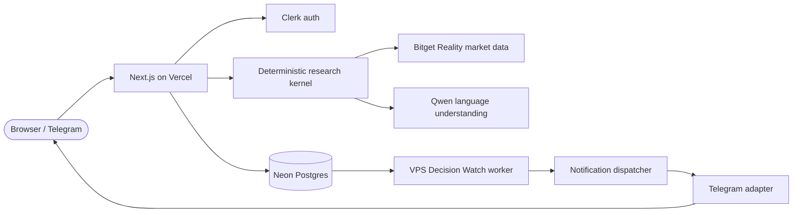

# CLINCH

Research the decision, not the entire market.

**[Live Demo](https://clinch-nine.vercel.app)** · **[GitHub](https://github.com/Techkeyy/clinch)**

> *"I'm considering TSLA, but what is the one thing I still need to know before I decide?"*

Most AI trading tools answer that question with more information: more signals, more charts, more noise. CLINCH does the opposite. It finds the single unanswered question most capable of changing your decision, researches only that with live market evidence, and stops when further research is unlikely to matter. The human always decides. CLINCH never places a trade.

## Why this exists

Generic AI trading dashboards, signal bots, and screener tools share one failure mode: they gather everything available and leave the triage to you. None of them answer the prior question, which evidence is worth your next minute, and none of them tell you when to stop looking.

CLINCH exists because Bitget's tokenized US stocks (rTokens) trade 7x24 while the underlying companies do not. Off-hours prices keep printing on thin internal liquidity, so "the price moved" is often decision-useless noise. CLINCH separates moves worth acting on from moves worth ignoring, using only live Bitget Reality market data:

```
YOUR DILEMMA                what generic tools give you
"Should I enter TSLA?"  ->  price + 20 indicators + news + sentiment
                                    |
              -- CLINCH keeps only this --
                                    v
               the Decision Hinge (one question) + the
               highest-value evidence family + an explicit stop
```

## What it does

1. **Describe** the decision in plain words (ticker optional; search 1,653 supported stocks or pick a featured card).
2. **Extract** intent deterministically (asset, action, timeframe); Qwen helps parse language only.
3. **Identify** the Decision Hinge, the unresolved question most likely to change the decision.
4. **Select** the highest-value research family by rule: spot-structure or perp-positioning.
5. **Research** with live Bitget data (ticker, candles, depth, funding/OI/mark-index where supported).
6. **Update** the decision state from deterministic finding classification, never from prose.
7. **Skip** irrelevant research explicitly, with reasons shown.
8. **Stop** with a brief when remaining checks cannot matter; unresolved paths stay unresolved honestly.
9. **Decide**, human. CLINCH researches the decision. It never places the trade. (Signed-in research saves privately to your CLINCH account via email OTP and persists across devices.)
10. **Monitor** (optional): a Decision Watch re-checks one state change on a 10-minute cadence and notifies once via Telegram. It is a state-change alert, never a buy signal.
11. **Control** from Telegram: inspect watches, pause/resume/stop, review recent research, open the desk.

## Bitget integration (what is real)

- Reality spot discovery: `GET /api/v3/market/instruments?category=SPOT` (`isReality`, `status`), joined to `GET /api/v3/reality/market/stock-info` for exact symbol/code/company mapping. Exact symbols persisted verbatim (e.g. `RMETAUSDT`); nothing synthesized.
- Market evidence: `GET /api/v3/market/tickers`, `/candles` (1m/5m/15m/1H/4H/1D), `/orderbook` on SPOT; RWA-perp positioning (funding, open interest, mark/index) on USDT-FUTURES.
- Catalog contract: visible stocks always equal researchable stocks (1,653 / 1,653 / 0 broken in production). A listed stock can never fail as unsupported.
- Qwen (`qwen3.8-max` via sponsored gateway): parses dilemma language and polishes nothing authoritative. The deterministic kernel owns support, reads, hinge, skip, and stop. No Agent Hub, Playbook, or `bitget-signal` dependency: those surfaces were evaluated live during development and excluded (empty backends that night; direct proven REST paths suffice), so CLINCH integrates exactly the data it can prove.

## Decision Watch

- One watch = one state change on one research conclusion (e.g. Better to wait → Slightly favorable), then it terminates.
- A durable VPS worker leases due watches exclusively, re-checks evidence, persists heartbeat or transition, releases the lease, and dispatches at most one Telegram notification per transition (dedupe keyed).
- Production soak: the live Tesla watch is processed every ~10 minutes, stays ACTIVE while nothing material changes, and emits no false alerts.
- Honest limit: no genuine target transition occurred during the soak (non-blocking; the transition/dispatch/dedupe path is covered by deterministic regression tests on production code).

## Telegram Companion

Linked chats (bound to a Clerk account via one-time token; Telegram is never identity) get: `/start` home, `/watches` with per-watch cards, `/recent` (latest 5), `/help`, inline Pause/Resume/Stop with the same authorization rules as the web UI, Open Research deep links, and Open CLINCH. Unknown callbacks are acknowledged without mutation.

## Security and ownership

Clerk user IDs own account data, never emails. Guest research is owned by a secure cookie plus HMAC verifier and can be claimed after sign-in, never by session-ID possession. Mutations require same-origin requests. The Telegram webhook requires its shared secret; callbacks re-prove watch ownership on every action. No secrets appear in logs or responses.

## Architecture



| Module | Job |
|---|---|
| `domain/kernel` | Deterministic hinge, skip, and stop decisions |
| `research/bitget` | Live Reality discovery, ticker, candles, depth, perp positioning |
| `research/orchestrator` | Baseline context plus selective evidence fetching |
| `server/flow` | Session research loop with persisted steps |
| `server/watch-runner` | Leased due-watch processing and transition detection |
| `notifications` | Channel-neutral dispatcher plus Telegram adapter |
| `persistence` | Session and watch stores (SQLite dev, Neon production) |
| `app/api` | Web, research, account, watch, and Telegram webhook routes |

## Why Open Theme matters

The named AI Trading Desk sub-themes cover extraction, review, stress testing, personalization, and execution help. CLINCH's core mechanism, the Decision Hinge with selective evidence and an explicit stop rule, cuts across all of them: it is a research-workbench primitive, not one lane feature. Proof from the demo: one dilemma becomes one hinge, one evidence check, and one recorded skip, which no named sub-theme describes on its own.

## Quickstart

Prerequisites: Node 20 or later, npm, Git.

```bash
git clone https://github.com/Techkeyy/clinch.git
cd clinch
npm install
```

Configure (names only; values stay local, never commit them):

```bash
cp .env.example .env.local
# Fill in: BITGET_QWEN_API_KEY, QWEN_BASE_URL, QWEN_MODEL,
# DATABASE_URL (omit for local file-backed dev),
# SESSION_PEPPER, NEXT_PUBLIC_CLERK_PUBLISHABLE_KEY, CLERK_SECRET_KEY,
# TELEGRAM_BOT_TOKEN, TELEGRAM_BOT_USERNAME, TELEGRAM_WEBHOOK_SECRET
```

Run, then open http://localhost:3000:

```bash
npm run dev
```

Offline-safe checks (no network, fixture-backed):

```bash
npm test -- --run
npm run typecheck
npm run lint
npm run build
```

## How I tried to break it

| Failure attempt | Expected invariant | Observed behavior | Evidence |
|---|---|---|---|
| Listed stock that later fails research (META) | Visible always equals researchable | Catalog contract enforced; META resolves end to end | `stock-catalog-invariant` tests, production 1653/1653/0 |
| R-prefixed tickers colliding (`RDY` vs `DY`) | Distinct issuers stay distinct | No R-stripping; round-trip per ticker | invariant tests, live catalog |
| Stale Clerk cookie namespace after key rotation | Server reads current session | Trimmed key syncs suffix; probes prove flip | `clerk-cookie-suffix` tests, production probes |
| Guest claims another account's research | Cross-account claim rejected | `CLAIM_ALREADY_OWNED_BY_OTHER_ACCOUNT`, row unchanged | `account-claim` tests |
| Foreign Telegram chat reads watches | No private data without link | Link prompt only, zero rows exposed | `telegram-companion` tests |
| Foreign Telegram chat drives a watch callback | Ownership re-proven server-side | Rejected, owner's watch unchanged | `telegram-companion` tests |
| Two workers race one due watch | Exclusive lease | Second claim gets nothing until expiry | `watch-worker` tests |
| Same transition delivered twice | Dedupe | Second dispatch returns deduped, one send | `watch-transition` tests |
| Missing Telegram connection at dispatch | No send, watch paused safely | `unavailable` path, no Telegram call | `watch-transition` tests |
| Malformed callback data | Ack, no mutation | Unknown action acknowledged, state untouched | `telegram-companion` tests |
| Wrong webhook secret | 401, no processing | 401 before any state read | `telegram-linking` tests |
| Replayed Telegram link token | Single use | Second use inert, ownership unchanged | `telegram-linking` tests |
| Flat market on a due watch | Heartbeat, no false alert | ACTIVE kept, version held, nothing sent | `watch-transition` tests, live soak |
| Expired research session | Never served as live | Lazy expiry on read | `recovery` tests |
| Unknown stock symbol | Honest unknown, never invented support | `UNKNOWN_ASSET`, no fabricated row | catalog tests |

Key invariant: **a visible stock is always researchable; a missing capability is reported, never invented.**

Trust architecture in one sentence: deterministic rules decide support, reads, and stops; Qwen only interprets language.

## Known limitations

- CLINCH researches decisions; it does not execute trades and is not financial advice.
- No genuine market-triggered watch transition occurred during the production soak (non-blocking; path covered deterministically).
- Telegram is a companion and control surface, not a duplicated research engine.
- rToken off-hours liquidity is thin; depth/shape readings carry that caveat.
- Demo video not yet recorded (script in `DEMO_SCRIPT.md`).

## Tests and proof

- Suite: 223 passed, 4 skipped (`npm test -- --run`; live-network test gated behind `LIVE_BITGET=1`).
- Typecheck, lint, and production build clean.
- Live: https://clinch-nine.vercel.app with 1,653 visible/researchable stocks and 0 broken.
- Owner-verified in production: email OTP, guest-to-account claim, persistence across sign-out/in, watch creation, Telegram linking plus confirmation receipt, worker heartbeat on a live watch, Telegram companion home and watches.

## License

Not yet assigned; owner to add a LICENSE file before submission.
